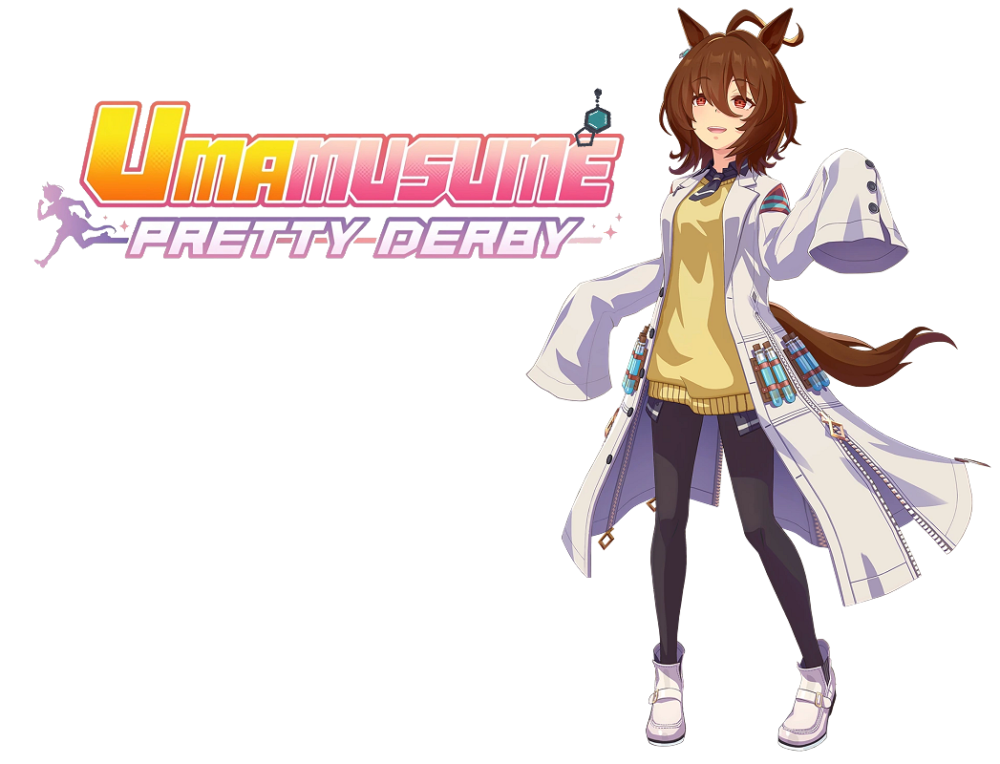

# Umamusume Plymouth Themes

Simple [umamusume](https://umamusume.com/) plymouth themes



*Also check out [umamusume-grub-themes](https://github.com/summerwya/umamusume-grub-themes) for themes for your grub!*

## List of Umamusumes Added

- [Agnes Tachyon](agnes-tachyon)

## Installation

### Prerequisites

Having [plymouth](https://www.freedesktop.org/wiki/Software/Plymouth/) configured on your system. For example, on [Arch Linux](https://archlinux.org/) [this](https://wiki.archlinux.org/title/Plymouth) is how you set it up.

### Step 1

Download [this](https://github.com/summerwya/umamusume-plymouth-themes/archive/refs/heads/main.zip) zip file

### Step 2

Extract `umamusume-plymouth-themes-main` into a folder

### Step 3

Run

```bash
# We should be in this folder when running this command: ~/path-to-extraction-folder/umamusume-plymouth-themes-main
sudo chmod +x/install-all.sh && sudo ./install-all.sh
```

### Step 4

Select your plymouth theme!
```bash
sudo plymouth-set-theme -R agnes-tachyon # Or any of the available umas!
```

## Credits

- All characters are from [Umamusume: Pretty Derby](https://umamusume.com/)
- Tachyon's earring is by [CrossSeija](https://www.rolimons.com/ugc-creator-store/680225221) from [here](https://www.rolimons.com/item/80163100980537)